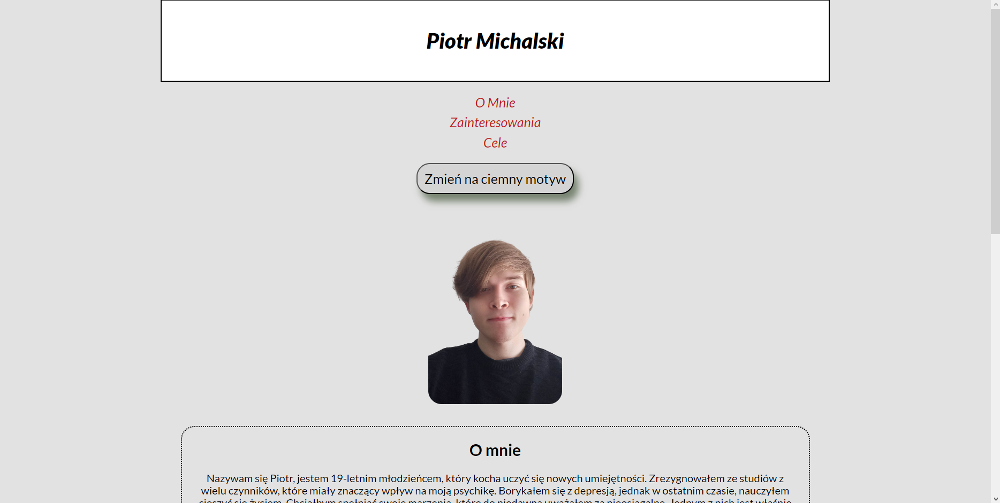

# Homepage
This is my very first project, made as a homework during my journey in YouCode course. It consists of simple usage of newly learned skills in **HTML**, **CSS** and **JavaScript**, presenting some information about me.

## Demo:
https://p-michalski.github.io/homepage/

## Tools used:
- HTML
- CSS
- Javascript

*Project was made, using BEM convention.*
